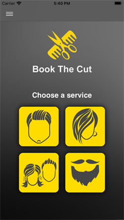
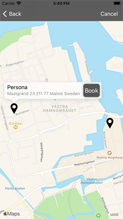
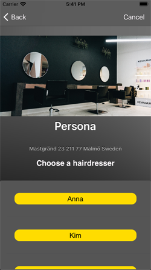
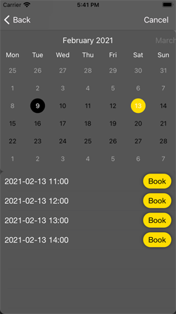
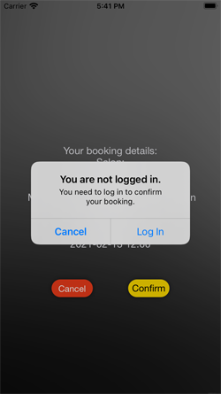
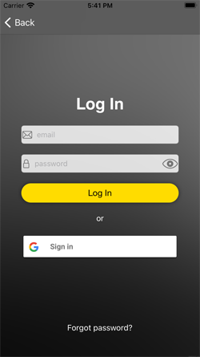
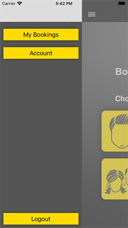

**Test data:** simulator GPS settings: 55,613801 12,981432 ;  FirebasedDatabase test data in "DatabaseTestData.json" file

<h1> BookTheCut</h1>

A group project for the "Programmerare iPhone och Android" course.

**Participants:**
- Vitaliy Beletskiy (coding)
- Subhi Hokan (design and its implementation)

**AppStore link:** I removed the app from the App Store as there is no real business behind it.

**BookTheCut** is a client-part booking application which **helps you to book your visit to a beauty salon or a barbershop.**

**The app uses:**
- Firebase Auth (Email and Google providers)
- Firebase Database
- Apple Maps
- PromiseKit (https://github.com/mxcl/PromiseKit)
- FSCalendar (https://github.com/WenchaoD/FSCalendar)
- SideMenu (https://github.com/jonkykong/SideMenu)

  
  
  
  
  
  
  

